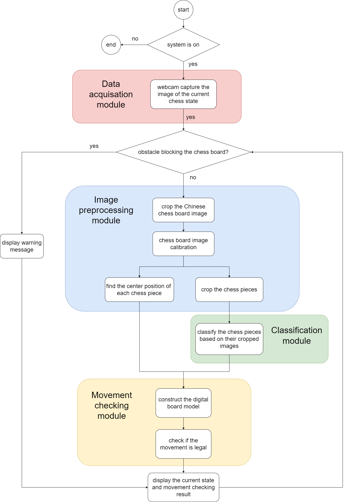

# XiangqiTracker
Repository for AMME4710 (2023) Team F's Major Project 

The game of Chinese Chess (Xiangqi) continues to engage individuals globally owing to its rich cultural heritage and intellectually stimulating gameplay. However, the conventional manual methods of gameplay enhancement and analysis pose challenges due to their laborious nature and potential inaccuracies, often limiting the quality of feedback necessary for strategic refinement. This study embarks on a quest to overcome these hindrances by leveraging computer vision and image processing technologies to automate gameplay data collection and analysis. The proposed system aims to transcend the limitations of existing pedagogical tools by providing immediate, precise feedback, thereby revolutionizing the learning and analytical framework within which players operate. The envisioned system entails accurately identifying boards and pieces under varying conditions, tracking movement to uphold game rules, and ensuring adaptability to different physical settings. By automating data handling and offering real-time insights, the system is designed to expedite skill development and deepen the appreciation of Xiangqi's strategic essence among players, ranging from novices to experts. Through meticulous exploration, development, and application of novel methodologies, this research strives to establish a foundational framework for the incorporation of technological advancements in the strategic analysis of Chinese Chess. The ultimate goal is to significantly contribute to the domain of Xiangqi, providing a robust, replicable model for the infusion of computer vision and image processing technologies in board game strategy analysis and learning.

